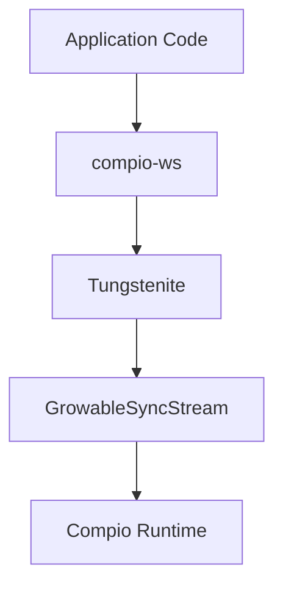
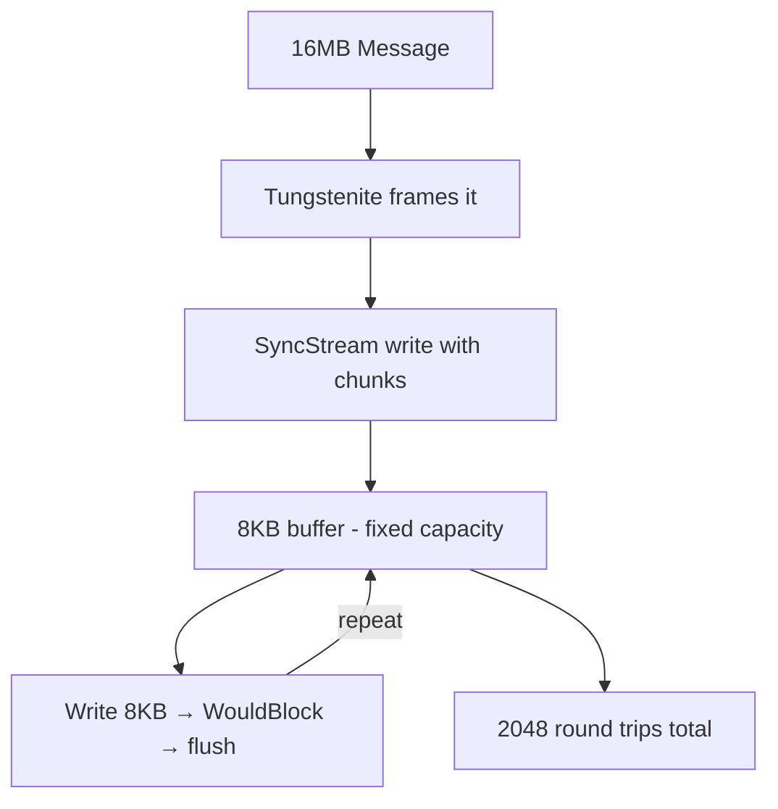

# Building WebSocket Protocol in Apache Iggy using io_uring and Completion Based I/O Architecture

Published: 2025-11-17

Rendered page: https://iggy.apache.org/blogs/2025/11/17/websocket-io-uring/

Source: https://github.com/apache/iggy-website/blob/main/content/blog/websocket-io-uring.mdx

## Introduction

In our [0.5.0 release blog post](https://iggy.apache.org/blogs/2025/08/10/release-0.5.0), we announced that work was underway on a complete rewrite of Apache Iggy's core architecture using io_uring with a thread-per-core, shared nothing design. This architectural redesign aims to further improve performance, reduce tail latecies and lower resource usage by **leveraging io_uring's completion based I/O model**.


As part of this rewrite, we migrated from Tokio to [compio](https://github.com/compio-rs/compio), a completion-based async runtime that allows us to better utilize io_uring capabilities. However, it also presents different challenges when integrating with the wider Rust ecosystem.

We came across one such challenge when we needed to add WebSocket support to Iggy server. WebSockets are useful for browser clients and streaming dashboards. The Rust ecosystem has excellent WebSocket libraries like [tungstenite](https://github.com/snapview/tungstenite-rs) and [tokio-tungstenite](https://github.com/snapview/tokio-tungstenite) but they are made when poll-based IO was the dominanat IO paradigm. They expect shared buffers and readiness-based I/O, fundamentally incompatible with compio's completion-based model that requires owned buffers.

Here we describe our journey of building compio-ws, a WebSocket implementation for the compio async runtime, and the engineering challenges we faced bridging two fundamentally different I/O models and it finally lead to us [contributing](https://github.com/compio-rs/compio/pull/501) to `compio`.

---

## Understanding the architectural divide (poll vs completion)

Let's see why poll-based libraries can't easily work with completion based runtimes by examining the traits of compio, tungstenite.

```rust
// The Rust std::io::Read trait (what tungstenite expects)
pub trait Read {
   fn read(&mut self, buf: &mut [u8]) -> Result<usize>;
   //                     ^^^^^^^^^^
   //                     Mutable borrow - caller owns buffer
}


// What compio needs
pub trait AsyncRead {
   async fn read<B: IoBufMut>(&mut self, buf: B) -> BufResult<usize, B>;
   //                                         ^
   //                                         Owned buffer - kernel owns it temporarily
}
```

The Read trait assumes you borrow a buffer. Compio's AsyncRead needs to take ownership of the buffer, submit it to the kernel, and return it later.

```rust
// Tungstenite's WebSocket structure
pub struct WebSocket<Stream> {
   socket: Stream, // Expects Stream: Read + Write
   // ... internal state
}


impl<Stream: Read + Write> WebSocket<Stream> {
   pub fn read(&mut self) -> Result<Message> {
       // Calls self.socket.read(&mut buf) internally
       // Expects to borrow buffers, not own them
   }
}
```

There's no way to make this work directly with compio's owned-buffer model. The abstractions are fundamentally incompatible.

When we need to add WebSocket support, we can't just drop in tokio-tungstenite, which uses `future_util::io::AsyncRead` trait. We need an adapter that:

- Works with compio's owned-buffer async I/O
- Presents synchronous Read/Write traits to tungstenite
- Efficiently bridges sync and async world

---

## Challenge with Tungstenite

Tungstenite is the de-facto Rust WebSocket protocol implementation. It handles all the WebSocket protocol logic:
- Frame parsing and generation
- Message fragmentation
- Control frames (ping, pong, close)
- Protocol violations and error handling
- Text encoding validation

Our initial thought was to contribute to async-tungstenite, which provides runtime-agnostic WebSocket support. It has adapters for multiple async runtimes through a trait-based abstraction. But as we dug deeper into adapting it for compio we realized a fundamental incompatibility

The realization: async-tungstenite is strongly coupled to poll-based IO

The incompatibility becomes clear when we examine the AsyncRead traits of compio and Future's AsyncRead

```rust
// Compio's async read - can't be made into a poll-based trait
async fn read<B: IoBufMut>(&mut self, buf: B) -> BufResult<usize, B>;
//                              Owned buffer ^^^^


// Futures' AsyncRead - expects polling with borrowed buffers
fn poll_read(self: Pin<&mut Self>, cx: &mut Context<'_>, buf: &mut [u8]) -> Poll<io::Result<usize>>;
//                                           Borrowed buffer ^^^^
```

These are fundamentally different programming models that don't compose cleanly.

## Decision: A separate crate

After realizing the incompatibility, we've decided to create `compio-ws` as a standalone crate. The architecture would be:



The key insight: we need a bridge layer that provides synchronous Read/Write traits to tungstenite while internally using compio's async owned-buffer I/O.

---

## First Attempt: `SyncStream`

Compio already provides `SyncStream` in the `compio-io::compat` module specifically for interoperating with libraries that expect synchronous I/O traits. It's a clever structure that maintains internal buffers to bridge the async/sync boundary:

```rust
pub struct SyncStream<S> {
   stream: S,                    // The async compio stream
   eof: bool,                   
   read_buffer: Buffer,          // Internal read buffer
   write_buffer: Buffer,         // Internal write buffer 
}


impl<S> SyncStream<S> {
   pub fn new(stream: S) -> Self {
       Self::with_capacity(DEFAULT_BUF_SIZE, stream)
   }
}
```

The default `DEFAULT_BUF_SIZE` is 8KB, but you can specify any capacity you want. Once created, the buffer capacity is fixed. It never grows. This can be a problem, which we will discuss below, read along.

Here's how it works:

Reading (sync to async):

```rust
impl<S> Read for SyncStream<S> {
   fn read(&mut self, buf: &mut [u8]) -> io::Result<usize> {
       let available = self.read_buffer.slice(); // Get buffered data
      
       if available.is_empty() && !self.eof {
           // No data available - need to fill from async stream
           return Err(io::Error::new(
               io::ErrorKind::WouldBlock,
               "need to fill the read buffer"
           ));
       }
      
       // Copy from internal buffer to caller's buffer
       let to_read = available.len().min(buf.len());
       buf[..to_read].copy_from_slice(&available[..to_read]);
       self.read_buffer.advance(to_read);
      
       Ok(to_read)
   }
}


impl<S: AsyncRead> SyncStream<S> {
   pub async fn fill_read_buf(&mut self) -> io::Result<usize> {
       // Async operation to fill the internal buffer
       let len = self.read_buffer
           .with(|b| async move {
               let len = b.buf_len();
               let b = b.slice(len..);
               self.stream.read(b).await.into_inner()
           })
           .await?;
      
       if len == 0 {
           self.eof = true;
       }
       Ok(len)
   }
}
```

Writing (sync to async):

```rust
impl<S> Write for SyncStream<S> {
   fn write(&mut self, buf: &[u8]) -> io::Result<usize> {
       if self.write_buffer.need_flush() {
           // Buffer full - need async flush
           return Err(io::Error::new(
               io::ErrorKind::WouldBlock,
               "need to flush the write buffer"
           ));
       }
      
       // Copy into internal buffer
       let len = buf.len().min(self.write_buffer.remaining_capacity());
       // ... copy data ...
       Ok(len)
   }
  
   fn flush(&mut self) -> io::Result<()> {
       // Just return Ok - actual flushing happens in flush_write_buf
       Ok(())
   }
}


impl<S: AsyncWrite> SyncStream<S> {
   pub async fn flush_write_buf(&mut self) -> io::Result<usize> {
       // Async operation to flush the internal buffer
       let len = self.write_buffer.flush_to(&mut self.stream).await?;
       self.stream.flush().await?;
       Ok(len)
   }
}
```

The pattern is:
- Sync `read()`/`write()` operate on internal buffers
- Return `WouldBlock` when buffer is empty/full
- Call async `fill_read_buf()`/`flush_write_buf()` to service buffers
- Retry the sync operation

This allows tungstenite to work with compio streams:

```rust
let stream = TcpStream::connect("127.0.0.1:8080").await?;
let sync_stream = SyncStream::new(stream);
let mut websocket = WebSocket::from_raw_socket(sync_stream, Role::Client);


loop {
   match websocket.read() {
       Ok(msg) => process(msg),
       Err(Error::Io(e)) if e.kind() == ErrorKind::WouldBlock => {
           // Need to fill the read buffer
           websocket.get_mut().fill_read_buf().await?;
           continue;
       }
       Err(e) => return Err(e),
   }
}
```

---
## The problem with fixed buffer size in `SyncStream`

The initial implementation worked perfectly for messages smaller than the buffer. WebSocket handshakes completed, ping/pong frames exchanged, text messages flowed. Everything seemed fine.

Then we tested with larger messages, and the performance collapsed.

The Problem Scenario: Sending a 16MB binary message through WebSocket with the default 8KB SyncStream buffer:

Here's what happens inside:



The measurements were bad:
- Time: Over 100 seconds to send 16MB
- Memory: Excessive allocations from repeated buffer handling. At times this lead to the websocket process being OOM killed by the OS.

Each `WouldBlock` -> async call -> retry cycle involved:
- Saving state in tungstenite
- Suspending the sync call
- Executing async flush
- Resuming the sync call

The sync trait contract requires immediate success or `WouldBlock`. There's no way to say "I need a bigger buffer" or "give me partial progress while I grow the buffer." Each `WouldBlock` forces a complete async round trip.

We tried the obvious fix of increasing the `SyncStream` buffer size to 1MB. Which worked perfectly and compio-ws passed all tests in the standard autobahn testsuite. But this solution is still fragile when the user doesn't know the peak memory usage of their workload and this can lead to overprovisioning and wastage of server resources. 

## The Solution: `GrowableSyncStream`

Design goals:
- Dynamic growth: Buffers start small and grow as needed
- Bounded maximum: Prevent memory exhaustion with configurable limits
- Automatic shrinking: Return to base capacity based on a threshold
- Minimal round trips: Handle large messages without constant `WouldBlock`

Architecture Overview:

```rust
pub struct GrowableSyncStream<S> {
   inner: S,                     // The async compio stream
   read_buf: Vec<u8>,            // Dynamic read buffer
   read_pos: usize,              // Current read position in buffer
   write_buf: Vec<u8>,           // Dynamic write buffer 
   eof: bool,                    // End of stream marker
   base_capacity: usize,         // Starting capacity (default: 8KB)
   max_buffer_size: usize,       // Maximum size (default: 64MB)
}
```

Buffer growth strategy:
- Start with a small sized buffer (128 KB matching tungstenite default buffer size)
- Grow in predictable increments of `base_capacity` sized chunks
- Cap growth at reasonable limit (64MB default)
- Shrink back to `base_capacity` when all data is consumed and current size > 4x base_capacity

Key operations:

Read path:
- Compacts buffer when needed (moves unread data to front)
- Grows in `base_capacity` increments during `fill_read_buf()`
- Shrinks back to base when all data consumed and buffer > 4× base

Write path:
- `Vec::extend_from_slice` handles growth automatically up to `max_buffer_size`
- Returns `WouldBlock` only when approaching max limit
- `flush_write_buf()` handles progressive flushing and shrinks back to base

With these changes compio-ws successfully passes the all the tests in `autobahn-testsuite` that `tokio-tungstenite` passes.

---

## Benchmarks

### Benchmark Methodology

To understand the real-world performance characteristics of compio-ws, we ran Apache Iggy's pinned producer benchmark and pinned consumer benchmark

The following benchmarks are run using AWS i3en.3xlarge instance using 24.04 Ubuntu OS.

**Hardware Specifications:**
- **CPU:** Intel Xeon Platinum 8259CL @ 2.50GHz (Cascade Lake)
- **Cores:** 6 physical cores with hyperthreading (12 vCPUs total)
- **Cache:** 36 MB L3 cache
- **Memory:** 96 GB RAM
- **Storage:** Local NVMe SSD

Common benchmark setting used:
- enable fsync and fsync every single message (`export IGGY_SYSTEM_PARTITION_ENFORCE_FSYNC=true` and `export IGGY_SYSTEM_PARTITION_MESSAGES_REQUIRED_TO_SAVE=1`)
- Use huge pages in linux.
```
sudo sysctl -w vm.swappiness=10
sudo sysctl -w vm.dirty_background_ratio=10
sudo sysctl -w vm.dirty_ratio=30
sudo sysctl -w vm.nr_hugepages=2048


export MIMALLOC_ALLOW_LARGE_OS_PAGES=1
export MIMALLOC_RESERVE_HUGE_OS_PAGES=2048
```

Workload characteristics:
- 4 Producers (one per CPU core)
- 4 Streams, 1 Topic per Stream, 1 Partition per Topic
- 1000 messages per batch
- 40,000 batches
- 1000 bytes per message
- Total: 40M messages, 40GB of data

We compared two scenarios:
- TCP: Direct TCP connection (baseline)
- WebSocket: compio-ws with GrowableSyncStream

### Results: TCP vs WebSocket

| Percentile   |      TCP | WebSocket | Difference              |
| ------------ | -------: | --------: | ----------------------- |
| Average      |  2.61 ms |   3.43 ms | +0.82 ms (31.4% higher) |
| Median (P50) |  2.58 ms |   3.34 ms | +0.76 ms (29.5% higher) |
| P95          |  2.94 ms |   4.00 ms | +1.06 ms (36.1% higher) |
| P99          |  3.63 ms |   4.56 ms | +0.93 ms (25.6% higher) |
| P999         |  3.84 ms |   5.27 ms | +1.43 ms (37.2% higher) |
| P9999        |  5.27 ms |   9.48 ms | +4.21 ms (79.9% higher) |
| Max          | 11.63 ms |  16.88 ms | +5.25 ms (45.1% higher) |
| Min          |  1.93 ms |   2.60 ms | +0.67 ms (34.7% higher) |

Benchmark graphs:

#### TCP 


#### WebSocket


---

Next we look at pinned-consumer benchmark.

Workload characteristics:
- 4 Consumers (one per CPU core)
- 4 Streams, 1 Topic per Stream, 1 Partition per Topic
- 1000 messages per batch
- 40,000 batches
- 1000 bytes per message
- Total: 40M messages, 40GB of data

| Percentile   |     TCP | WebSocket | Difference                   |
| ------------ | ------: | --------: | ---------------------------- |
| Average      | 0.70 ms |   1.44 ms | +0.74 ms (105.7% higher) |
| Median (P50) | 0.68 ms |   1.41 ms | +0.73 ms (107.4% higher) |
| P95          | 0.85 ms |   1.73 ms | +0.88 ms (103.5% higher) |
| P99          | 1.00 ms |   1.95 ms | +0.95 ms (95.0% higher)  |
| P999         | 1.32 ms |   2.26 ms | +0.94 ms (71.2% higher)  |
| P9999        | 1.54 ms |   2.52 ms | +0.98 ms (63.6% higher)  |
| Max          | 2.02 ms |  10.44 ms | +8.42 ms (416.8% higher) |
| Min          | 0.55 ms |   1.14 ms | +0.59 ms (107.3% higher) |

Benchmark graphs:

#### TCP 


#### WebSocket


### Analysis:

The results show measurable but **reasonable** overhead from the WebSocket layer:

**Producer latency:** WebSocket adds ~0.8-1.0ms across most percentiles (30-40% higher than TCP). Even at P9999, we achieve 9.48ms latency - impressive for a durable workload with fsync-per-message enabled.

**Consumer latency:** WebSocket shows roughly 2× the latency of raw TCP, adding ~0.7-1.0ms. The P9999 of 2.52ms demonstrates consistent performance even at high percentiles.

Under durability constraints, achieving single-digit millisecond latencies at P9999 for producers and sub-3ms for consumers is quite good.

**Adapter layer cost:** The current implementation uses GrowableSyncStream as a bridge between sync and async I/O models. The buffer grows in linear increments, which can be suboptimal for large messages. However, for this first implementation enabling WebSocket support in a completion-based runtime, the performance is acceptable.

**WebSocket protocol overhead:**
- WebSocket framing: each message needs frame headers.
- Masking: XOR operation on payload

**Tail latency consistency:** GrowableSyncStream maintains roughly proportional overhead even at high percentiles. The P9999 shows larger absolute differences but percentage-wise remains consistent with lower percentiles, indicating predictable behavior under load.

---

## Future Work

1. Smarter Buffer Growth
   - Current: Linear `base_capacity` increments
   - Better: Exponential growth (like `Vec::reserve`)
   - Impact: Reduce reallocation overhead for large messages

2. Buffer Pooling
   - Current: Allocate/deallocate per message
   - Better: Per-core buffer pools with object reuse
   - Impact: Reduce allocator pressure

3. WebSocket implementation with native owned buffers
   - Implement WebSocket protocol directly with owned buffers from scratch.
   - Direct integration with compio to use io_uring capabilities.
   - Could increase performance significantly.
   - This is a significant undertaking due to full RFC compliance.

We [contributed](https://github.com/compio-rs/compio/pull/501) `compio-ws` to `compio` and anyone interested in improving `compio-ws` can contribute to `compio`.

## Conclusion

**Current state in Iggy:** WebSocket support is currently implemented with long polling on the consumer side and push-based notifications is planned for future releases. This has different implications for producers and consumers.

**For consumers (receiving messages):** The current long polling implementation means consumers must repeatedly request new messages, even when none are available. This is inefficient, especially for low-power edge clients.

**For producers (sending messages):** WebSocket provides immediate benefits. Instead of establishing new connections or using inefficient long polling, producers can maintain a persistent WebSocket connection and push messages directly to the server. This is particularly valuable for:

- Browser-based producers sending events or telemetry
- Edge devices reporting sensor data or metrics
- Dashboard applications sending commands or configuration updates

**What's next:** While compio-ws with GrowableSyncStream enables WebSocket support today, significant optimization potential remains. A native WebSocket implementation designed for owned buffers from the ground up could eliminate the adapter layer overhead and unlock the full performance potential of io_uring's zero-copy capabilities.
We invite the Rust community to contribute:

- **Optimize** `GrowableSyncStream`: Implement exponential buffer growth and pooling
- **Owned buffer WS protocol implementation:** Build WebSocket from scratch with owned buffers
- **Push-based consumers:** Help implement server-push notifications in Iggy
- **Edge client libraries:** Create WebSocket SDKs optimized for resource-constrained devices
