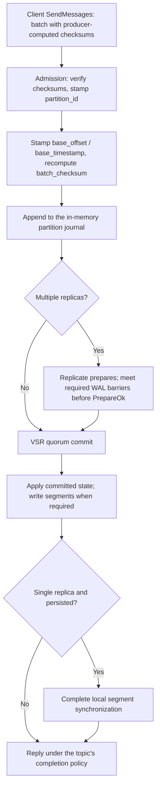

# Storage Engine

> The segmented append-only log, and how streams, topics, partitions and segments map onto files on disk.

Rendered page: https://iggy.apache.org/docs/server/storage-engine/

Source: https://github.com/apache/iggy-website/blob/main/content/docs/server/storage-engine.mdx

Iggy's storage engine is built around the concept of a **segmented append-only log**. Every piece of data flows through a well-defined hierarchy: System -> Streams -> Topics -> Partitions -> Segments. This page covers how data is stored, indexed, flushed, recovered, and cleaned up on disk.

<StreamHierarchy />

<AppendOnlyLogViz />

## Directory layout

All data lives under the root `path` directory (default `local_data`, overridden with `IGGY_PATH`):

```bash
local_data/
├── metadata/                        # Metadata plane (see below)
│   ├── journal.wal                  # Prepare journal: replicated metadata operations
│   ├── snapshot.bin                 # MessagePack snapshot of the metadata state machine
│   ├── superblock.a                 # Ping-pong superblock pair: checkpoint record,
│   └── superblock.b                 #   newest slot wins by sequence
├── state/
│   └── log                          # Created at boot; legacy state plumbing
├── runtime/                         # Runtime data
├── logs/                            # Server log files
└── streams/
    └── {stream_id}/
        └── topics/
            └── {topic_id}/
                └── partitions/
                    └── {partition_id}/
                        ├── superblock.a                  # Partition consensus superblock pair
                        ├── superblock.b
                        ├── prepares-{created_revision}/  # Prepare WAL, when a cluster topic policy is persisted
                        ├── offsets/
                        │   ├── consumers/                # Stored offsets of individual consumers
                        │   └── groups/                   # Stored offsets of consumer groups
                        ├── 00000000000000000000.log      # Segment: batch records
                        ├── 00000000000000000000.index    # Segment: sparse index
                        ├── 00000000000016000000.log
                        └── 00000000000016000000.index
```

Stream, topic, and partition ids are numeric and **0-based**. Each partition directory holds pairs of `.log` and `.index` files. The filename is the start offset of the segment's first message, zero-padded to 20 digits. Next to the segments, every partition keeps its own superblock pair (replica identity and consensus state for that partition) and an `offsets/` tree for consumer offset storage. Multi-replica partitions also keep a prepare WAL when either topic durability policy is `persisted`.

## Segmented log

<SegmentVisualization />

Each partition is a segmented log: an ordered list of **sealed** (read-only) segments plus one **active** (writable) segment. When the active segment reaches the topic's `segment_size` (default 1 GiB), it is sealed and a new active segment starts at the next offset.

`segment_size` is a per-topic creation option, bounded to a 512-byte multiple between 1 MiB and 1 GiB. It's a **soft limit**: rotation fires after the append that crosses it, so the crossing batch lands whole and a sealed segment may run one batch past the configured size. `preallocate_segments` (also per topic) reserves each segment's bytes up front on filesystems that support it. See [Topic options](/docs/server/topic-options).

## On-disk batch format

Segments store **batch records**, not individual messages. The record is byte-identical to the wire encoding: the one layout a `SendMessages` body, the replicated prepare, the persisted segment record, and the poll reply all share. There is **no other message encoding**.

```text
[batch header: 256 bytes][blob: message frames]
frame = [frame header: 48 bytes][payload][user_headers]
```

The 256-byte batch header carries `partition_id`, `base_offset`, `base_timestamp`, `origin_timestamp`, `batch_length`, `batch_checksum` (XxHash3-64), and `message_count`. The rest is reserved and must be zero. Each 48-byte frame header carries `checksum` (XxHash3-64), `id` (u128), `offset_delta` (u32), `timestamp_delta` (u32), and the two lengths. A message's absolute offset is `base_offset + offset_delta`; its server timestamp is the flat `base_timestamp`, while `timestamp_delta` resolves producer time against `origin_timestamp`. All fields are **little-endian**, and records are stored contiguously with no padding.

The full byte-level tables live on the [Message batches](/docs/binary-protocol/messages) page. Absent at-rest encryption, what lands on disk is exactly what the producer sent, with the server stamping `partition_id` at admission and `base_offset` / `base_timestamp` (plus a `batch_checksum` recompute) at journal append.

## Indexes

Each segment has an accompanying `.index` file holding a **sparse index**: one 24-byte entry per flushed write, not per message.

| Field | Bytes | Type | Description |
|-------|-------|------|-------------|
| offset | 0..8 | u64 | Absolute offset of the flushed batch |
| timestamp | 8..16 | u64 | Timestamp of the flushed batch |
| position | 16..24 | u64 | Byte position of the batch start in the `.log` file |

Little-endian, no header, no padding. To serve a poll, the server binary-searches the index for the closest entry at or below the target offset (or timestamp), seeks to its `position`, and walks batch records from there. Because the index is a sparse hint, a lookup below the indexed range falls back to the segment start rather than failing.

There is no index caching configuration: the in-memory index cache is an internal per-segment structure the server manages itself.

## Write pipeline

Messages are admitted, stamped, and buffered in the partition journal. Their completion path depends on the topic's durability policy:



The flush thresholds and completion policies are **per-topic creation options**:

- `messages_required_to_save` (default `1024`): count threshold.
- `size_of_messages_required_to_save` (default `1 MiB`): byte threshold.
- `durability` (default `replicated`): message completion policy; `persisted` requires recoverable stable storage at the replication quorum.
- `consumer_offset_durability` (default `replicated`): the independent policy for explicit offset stores and deletes.

A full active segment also triggers an ordinary flush. These are soft limits: a flush writes whole committed batches, so the actual count or size can overshoot. Required persistence, capacity pressure, and lifecycle operations can flush below the thresholds. The settings do not define a periodic flush interval. The `MessagesWriter` uses **vectored I/O** with up to 1024 buffers per syscall, so many buffered batches can land in one write.

With `replicated`, completion does not wait for an additional stable-storage barrier. With `persisted`, a single-replica partition flushes and synchronizes committed segment state before success. A multi-replica partition instead gates the required prepare acknowledgements on recoverable WAL history, so persisted success can precede an ordinary segment flush. `messages_required_to_save=1` is not required.

For multi-replica partitions, the disk prepare WAL is enabled when either policy is `persisted` and includes message payloads even if only the offset policy is persisted. Checkpoints synchronize materialized files before reclaiming WAL history. See [Durability](/docs/server/durability) and [Cluster Durability](/docs/clustering/durability) for completion guarantees and failure behavior.

## Boot-time segment recovery

At startup, recovery validates batch checksums, partition identity, and the segment chain before serving data. With message durability `replicated`, it walks the log from byte zero because buffered writeback can preserve later pages before earlier ones. With `persisted`, completed durable segment flushes allow an index-anchored recovery path.

A missing or torn sparse index can be rebuilt from valid log data. An incomplete tail can be truncated, but an interior gap, intact records after damage, or a contradiction with durable history can require recovery refusal. Recovery does not blindly truncate at the first invalid batch.

When a prepare WAL exists, recovery reconciles it with materialized segment and offset state. Unrecoverable partition data is fenced and repaired from peers when available. It must not be replaced by an empty healthy partition. A singleton has no peer copy to fetch.

## Read integrity

Disk reads are verified before they reach a consumer:

```toml
[partition]
validate_checksum = true
```

With `validate_checksum = true` (the default), every batch a disk poll reads is re-hashed and compared against its stored checksum. A mismatch **fails the poll closed**, so a segment damaged at rest is reported instead of served. Setting it to `false` skips the re-hash and serves whatever decodes, which can hand a consumer bytes provably not the ones written. Only disable it with a corruption guard elsewhere in the stack.

Polls serve stored batch records as-is (a reply may be a server-sliced view of a larger stored batch), so there is no re-encoding on the read path.

## Memory pool

Iggy includes a custom memory pool to eliminate allocation overhead on the hot path. The pool has **28 buckets** with buffer sizes from 4 KiB up to 512 MiB (non-uniform spacing, denser around common message sizes, with sizes above 2 MiB rounded to hugepage-friendly steps). Components request a buffer from the appropriate bucket and return it when done.

```toml
[memory_pool]
enabled = true
size = "4 GiB"            # Total pool size (minimum 512 MiB, multiple of the 4096-byte page size)
bucket_capacity = 8192    # Buffers per bucket (power of 2, minimum 128)
```

This avoids heap allocations during message processing and enables zero-copy message passing between internal components.

## Retention and cleanup

Two independent retention policies exist, both **per-topic creation options** (see [Topic options](/docs/server/topic-options)). The segment cleaner enforces them:

```toml
[data_maintenance.messages]
cleaner_enabled = true    # default
interval = "1 m"          # default
```

**Size-based retention** (`max_topic_size`): the cluster has no single owner of a topic-wide total, so each partition enforces an equal share: `max_topic_size / partition_count`, counted over **sealed** bytes. The share is floored at one sealed-segment ceiling (`segment_size` plus the maximum message-bus frame, since a sealed segment can overshoot by one batch). A cap that divides below that floor is raised to it, so the policy always means at least "keep the newest sealed segment". Once sealed bytes exceed the budget, the oldest sealed segments are trimmed. There is no percentage-based early trigger.

**Time-based retention** (`message_expiry`): sealed segments whose newest message is older than the expiry are deleted.

Both policies can be active at once. They only ever touch sealed segments. The active segment is **never deleted**, even if its messages have expired.

## Metadata plane

Metadata operations (create stream, delete topic, create user, and so on) do not use the partition storage above. They replicate through the metadata consensus group and persist in `local_data/metadata/`:

- **`journal.wal`**: the prepare journal. Each entry is a 256-byte `PrepareHeader` (the consensus header carrying checksums, view, op and commit numbers, operation discriminant, and acting user) followed by the operation's wire-format body, exactly as replicated. This is the write-ahead log: an operation is journaled before it is applied.
- **`snapshot.bin`**: a **MessagePack** (rmp-serde) snapshot of the whole metadata state machine, written at checkpoints so the journal can be truncated. Recovery loads the snapshot, then replays journal entries newer than it, rebuilding the client session table alongside.
- **`superblock.a` / `superblock.b`**: a ping-pong pair of checkpoint records, where the newest valid slot wins by sequence number. The superblock records which checkpoint is current and the snapshot's checksum. Boot cross-checks the pairing: a superblock pointing at a checkpoint newer than the on-disk snapshot, or a snapshot whose checksum doesn't match the record, refuses to boot rather than silently rewinding committed state.

Partition directories carry the same superblock mechanism for their own consensus state (replica identity, view), which is how a restarted replica proves it is itself rather than a blank impostor.

## Encryption

Iggy supports optional **AES-256-GCM** encryption for message payloads and user headers. They are encrypted before storage and decrypted for polling. Metadata journals, metadata snapshots, and structural record headers remain unencrypted. The key must decode from base64 to 32 bytes. See [Security](/docs/server/security#data-encryption-at-rest).

```toml
[encryption]
enabled = false
key = ""  # 32-byte base64-encoded key
```

## Compression

The `compression_algorithm` topic option accepts `none` (default) and `gzip`, but it is a **placeholder today**: the value is persisted and reported back, but no message compression is applied. Payload encryption still applies when enabled. To compress today, do it client-side and tag messages via user headers - see the [message headers examples](https://github.com/apache/iggy/tree/master/examples/rust/src/message-headers) in the Iggy repo.

## Removed and relocated settings

Earlier releases documented several storage features and `[system.*]` keys that no longer exist:

- **`cache_indexes`**: removed. Index caching is internal now (see [Indexes](#indexes)).
- **`[system.message_deduplication]`**: removed configuration; it does not configure the partition request deduplication table.
- **Segment archiving / S3 backup placeholders**: removed. Delete `archive_expired` and the old `[system.segment]` table rather than retaining a `false` value.
- **`enforce_fsync`**: replaced by the topic `durability` policy. Consumer-offset completion has its own `consumer_offset_durability` policy. Both default independently to `replicated`.
- **`[system.*]` tables**: removed or moved to root tables. Retention, segment size, preallocation, and flush thresholds are per-topic options.

The config loader rejects the old `[system]` table and `IGGY_SYSTEM_*` environment mappings. The full mapping is in [Relocated configuration keys](/docs/server/configuration#relocated-configuration-keys).
